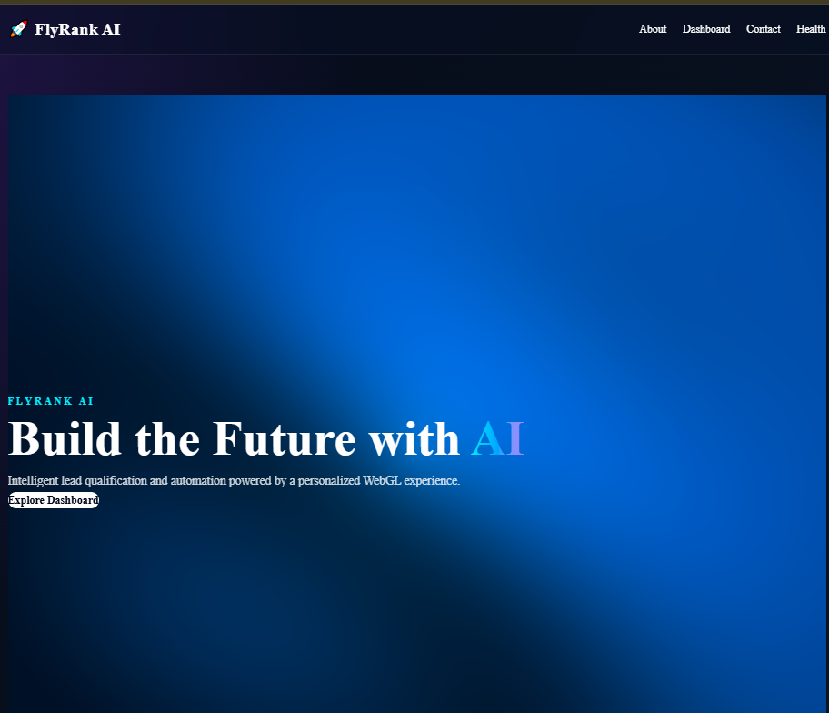

# 🚀 FlyRank AI Dashboard

A premium, responsive AI analytics dashboard built with **Next.js 16**, **React**, **TypeScript**, **Tailwind CSS**, and **Framer Motion**.

This project was developed as part of the **FlyRank Front-end AI Engineering Internship** and demonstrates modern frontend engineering practices, App Router architecture, reusable components, responsive UI design, animation, accessibility, streaming AI interactions, server-side AI tools, and production-ready project structure.

---

## ✨ Features

### 🎨 Premium UI

- Modern dark-themed interface
- Glassmorphism cards
- Gradient backgrounds and typography
- Responsive layouts
- Smooth hover interactions
- Premium visual hierarchy
- Consistent spacing and component styling


### ⚡ Next.js App Router

The application uses the modern Next.js App Router architecture with:

- Server Components by default
- Client Components only where interactivity is required
- File-system based routing
- Shared application layout
- Static and dynamic rendering support


### 🎬 Animations

The dashboard uses **Framer Motion** for interactive animations, including:

- Page entrance animations
- Staggered dashboard cards
- Hover effects
- Animated statistics counters
- Animated progress bars
- Scroll-triggered sections
- Smooth UI transitions


### 📊 AI Analytics Dashboard

The dashboard displays:

- Active Projects
- AI Models
- Team Members
- Success Rate
- Recent Activity
- Project Status
- Animated progress indicators

Statistics animate from their initial state to their final values instead of appearing instantly.

### 🤖 Streaming AI Chat

The application includes a streaming AI qualification chat with:

- Token-by-token AI responses
- Thinking indicator
- Stop generation control
- Multi-turn conversation state
- Distinct user and assistant messages
- Automatic scrolling
- Jump-to-latest control
- Responsive mobile input
- Server-side API key protection


### 🧰 AI Tool Integration

The AI chat includes a server-side `scoreLead` tool that:

- Uses a typed Zod schema
- Calculates a lead score
- Returns structured data
- Renders the result as a Lead Score card
- Displays distinct tool lifecycle states
- Provides a designed error state

---


## 🧭 Application Routes


| Route         | Description                         |
| ------------- | ----------------------------------- |
| `/`           | Landing page                        |
| `/about`      | Project and application information |
| `/dashboard`  | AI analytics dashboard              |
| `/contact`    | Contact page                        |
| `/health`     | Application health/status page      |
| `/chat`       | Streaming AI qualification chat     |
| `/api/health` | Health-check API endpoint           |
| `/api/chat`   | Streaming AI chat API endpoint      |


---


## 🛠️ Technology Stack


### Frontend

- **Next.js 16**
- **React**
- **TypeScript**
- **Tailwind CSS**
- **Framer Motion**


### AI

- **AI SDK**
- **Google Gemini**
- **Zod**
- Streaming AI responses
- Server-side AI tool execution


### Development

- **Node.js**
- **npm**
- **Git**
- **GitHub**
- **Cursor**


### Architecture

- Next.js App Router
- Reusable React components
- Server Components by default
- Client Components for interactive UI
- Responsive-first design
- Component-based styling
- Server-side AI API integration

---


## 📁 Project Structure

```text
flyrank-nextjs-capstone/
│
├── public/
│
├── src/
│   ├── app/
│   │   ├── about/
│   │   │   └── page.tsx
│   │   │
│   │   ├── api/
│   │   │   ├── chat/
│   │   │   │   └── route.ts
│   │   │   │
│   │   │   └── health/
│   │   │       └── route.ts
│   │   │
│   │   ├── chat/
│   │   │   └── page.tsx
│   │   │
│   │   ├── contact/
│   │   │   └── page.tsx
│   │   │
│   │   ├── dashboard/
│   │   │   └── page.tsx
│   │   │
│   │   ├── health/
│   │   │   └── page.tsx
│   │   │
│   │   ├── globals.css
│   │   ├── layout.tsx
│   │   └── page.tsx
│   │
│   ├── components/
│   │   ├── AnimatedCounter.tsx
│   │   │
│   │   └── chat/
│   │       └── Chat.tsx
│   │
│   └── lib/
│       └── ai/
│           ├── index.ts
│           └── tools.ts
│
├── .gitignore
├── AGENTS.md
├── CLAUDE.md
├── eslint.config.mjs
├── LICENSE
├── next.config.ts
├── package.json
├── postcss.config.mjs
├── README.md
├── tsconfig.json
└── package-lock.json
```


# ♿ FE-05 Accessibility Playground

This project includes an accessibility-focused component playground built with **React, TypeScript, and Next.js**.

## Components

- **Modal** — focus trapping, Escape-to-close, and focus restoration.
- **Tabs** — ARIA tab semantics with Arrow Left/Right, Home, and End keyboard navigation.
- **Disclosure** — semantic button interaction with `aria-expanded` and `aria-controls`.


## Accessibility Testing

All three components were manually tested using keyboard-only interaction.

Verified behaviors include:

- Tab navigation
- Shift + Tab navigation
- Enter
- Space
- Escape
- Arrow Left / Arrow Right
- Home / End
- Modal focus trapping
- Modal focus restoration
- Visible focus states


## Documentation

See `NOTES.md` for the accessibility implementation notes and comparison with shadcn/ui components.

---


# 🤖 FE-06 Streaming AI Chat

The application includes a streaming AI qualification chat built using the AI SDK and Google Gemini.

## Chat Features

- Token-by-token streaming responses
- Thinking indicator before the first response token
- Stop generation button
- Conversation state across multiple turns
- Distinct user and assistant messages
- Automatic scrolling while staying at the latest message
- Jump-to-latest control when the user scrolls upward
- Responsive mobile-friendly input
- Server-side API key handling


## Chat Route

The streaming API route is:

```
src/app/api/chat/route.ts
```


## Chat Component

The main chat component is:

```
src/components/chat/Chat.tsx
```


## AI Configuration

The AI model and system prompt are kept in:

```
src/lib/ai/index.ts
```

---


# 🧰 FE-07 AI Tool Contract

FE-07 adds a server-side `scoreLead` tool to the AI chat.

## Tool Name

`scoreLead`

## Purpose

Scores a potential FlyRank AI customer lead based on company size, monthly budget, and the customer's primary business goal.

## Tool Definition

The tool is defined in:

```
src/lib/ai/tools.ts
```

It is connected to the streaming chat API through:

```
src/app/api/chat/route.ts
```


## Input Schema

```
{
  companySize: "startup" | "small" | "medium" | "enterprise";
  monthlyBudget: number;
  goal: string;
}
```


## Return Shape

```
{
  score: number;
  category: string;
  companySize: string;
  monthlyBudget: number;
  goal: string;
}
```


## Tool Lifecycle States

The chat UI renders four tool lifecycle states with distinct visual treatments.

### `input-streaming`

Indicates that the tool input is still being prepared.

### `input-available`

Indicates that the qualification data has been received and the lead scoring process is running.

### `output-available`

Displays the successful tool result as a structured Lead Score card.

### `output-error`

Displays a designed error state when the tool execution fails instead of exposing a raw error or crashing the interface.

## Tool Result UI

Successful tool results are rendered as a structured **Lead Score card** showing:

- Lead score out of 100 
- Priority category 
- Company size 
- Monthly budget 
- Business goal

The result is displayed as a real UI component rather than raw JSON.

## Example Result

```

```

```
Lead Score

95 / 100

High Priority

Company: medium
Monthly budget: $5000
Goal: automate customer support and improve lead qualification
```

---


# 🔐 Environment Variables

AI API credentials are stored in environment variables and are never exposed directly in client-side code.

For local development, create:

```

```

```
.env.local
```

Example:

```

```

```
GOOGLE_GENERATIVE_AI_API_KEY=your_api_key_here
```

The environment file is excluded from Git through `.gitignore`.

For production deployment, the environment variable is configured in the deployment platform rather than committed to the repository.

---


# 🚀 Running the Project Locally

Install dependencies:

```
npm install
```

Start the development server:

```
npm run dev
```

Open:

```
http://localhost:3000
```

For the AI chat:

```
http://localhost:3000/chat
```

---


# 🏗️ Production Build

To verify the project before deployment:

```

```

```
npm run build
```

The production build completes successfully with the current implementation.

---


# 🌐 Deployment

The application is deployed using **Vercel**.

The deployed application includes:

- Responsive dashboard 
- Health check page 
- Streaming AI chat 
- Server-side AI API route 
- Lead scoring tool 
- Structured tool result UI

Environment variables required by the AI integration are configured on the deployment platform and are not committed to the repository.

---


# 🧪 Verification

The following functionality has been tested:

- Application routes load correctly 
- Health API responds successfully 
- AI chat sends and receives messages 
- AI responses stream progressively 
- Stop button interrupts generation 
- Conversation continues across multiple turns 
- Auto-scroll works during streaming 
- Jump-to-latest control works 
- Chat works at mobile width 
- `scoreLead` tool executes successfully 
- Lead Score result renders as a UI component 
- Tool lifecycle states are handled 
- Production build passes successfully

---


# 📚 Internship Context

This project is part of the **FlyRank Front-end AI Engineering Internship**.

The capstone progressively demonstrates:

- Modern frontend architecture 
- Accessibility 
- AI streaming interfaces 
- Structured AI tool interactions 
- Responsive UI engineering 
- Server/client separation 
- Production deployment 
- AI-assisted development workflows


## FE-AA1 — Motion & State Micro-interactions

Added an accessible Send Message button demonstrating multiple UI states:

- Idle
- Hover/focus
- Loading
- Success
- Error
- Disabled


### Motion decisions

State transitions use a short 200ms `ease-out` transition for responsive feedback. Hover and tap interactions use compositor-friendly `transform` properties. The loading indicator uses an 800ms rotation loop, while the error state uses a short transform-based shake.

The button is disabled during the simulated async operation to prevent broken or overlapping states. The demo provides explicit success and error triggers, plus a random mode with a 20% simulated failure rate.

`prefers-reduced-motion` is respected: animations are removed or reduced while visual and textual state feedback remains available.

## FE-AA2 — Interactive 3D Lead Intelligence

Built an interactive 3D lead intelligence experience using React Three Fiber and Three.js.

### What I built

- Interactive 3D lead intelligence orb
- Lead score controls (25, 50, 80)
- Orb appearance and scale respond to the selected score
- Touch/mouse orbit interaction
- Responsive mobile-friendly canvas
- Lazy-loaded 3D scene
- Static fallback for reduced-motion and low-power devices


### Performance note

The experience uses a procedural sphere instead of a heavy external 3D model. The 3D canvas is dynamically loaded, device pixel ratio is capped at 1.5, and reduced-motion/low-power devices receive a lightweight static fallback.

### With more time

I would add a lightweight 3D lead visualization with additional data points and richer interactions.

## FE-AA3 — Signature Hero: Fullscreen Shader

The home page includes a custom fullscreen GLSL fragment shader built with
React Three Fiber and Three.js.

### Shader Features

- Custom vertex and fragment shaders written in GLSL.
- Uses `u_time` for continuous animation.
- Uses `u_resolution` for responsive screen-space rendering.
- Uses `u_mouse` for interactive mouse-based glow.
- Custom blue, cyan and violet FlyRank-inspired visual palette.
- Hero content remains readable above the WebGL background.


### Performance and Accessibility

- Device pixel ratio is capped at `1.5` to reduce GPU workload.
- WebGL animation pauses when the browser tab is hidden.
- `prefers-reduced-motion` users receive a static gradient fallback.
- Shader comments explain the purpose of each major GLSL section.


### Live Experience

The shader hero is deployed on the production home page:

`https://flyrank-nextjs-capstone.vercel.app/`

---


# 🚀 FE-11 Production Deployment

This project is deployed as a production Next.js application.

## Production Features

- Public production deployment
- Server-side AI API integration
- Google Gemini streaming responses
- Server-side `scoreLead` tool execution
- Protected API credentials through environment variables
- Input limits on the AI route
- Maximum streaming duration of 30 seconds
- Responsive desktop and mobile UI
- Accessibility-focused interaction patterns
- Production build verification


## AI API Protection

The `/api/chat` route includes request-size protections to reduce trivial API abuse.

The route enforces:


| Protection                            | Limit      |
| ------------------------------------- | ---------- |
| Maximum messages                      | 20         |
| Maximum characters per message        | 4,000      |
| Maximum total conversation characters | 12,000     |
| Maximum streaming duration            | 30 seconds |


Oversized or malformed requests are rejected before being sent to the AI model.

The API key remains server-side and is never exposed to client-side JavaScript.

## Environment Variables

Create a `.env.local` file for local development:


| Variable                       | Required | Description           |
| ------------------------------ | -------- | --------------------- |
| `GOOGLE_GENERATIVE_AI_API_KEY` | Yes      | Google Gemini API key |


Example:

```env
GOOGLE_GENERATIVE_AI_API_KEY=your_api_key_here


```

Never commit `.env.local` or real API keys to Git.

For production, the same environment variable is configured through the deployment platform.

## Architecture Overview

```
Browser
   |
   v
Next.js App Router
   |
   +---- UI Pages
   |
   +---- Client Components
   |
   v
/api/chat
   |
   +---- Input validation / size limits
   |
   +---- AI SDK streaming
   |
   +---- scoreLead tool
   |
   v
Google Gemini
```

The application follows a server/client separation:

- Server Components are used by default. 
- Client Components are used for interactive UI. 
- AI credentials remain server-side. 
- AI requests pass through the Next.js API route. 
- Tool execution happens on the server. 
- Structured tool results are rendered by the client UI.


## Key Engineering Decisions


### Next.js App Router

Next.js App Router was selected to provide a clear server/client boundary and modern routing architecture.

### Streaming AI

AI responses are streamed progressively so users receive feedback without waiting for the complete response.

### Server-side AI Tools

The `scoreLead` tool runs on the server so qualification logic and AI configuration are not exposed directly to the browser.

### Input Caps

The chat endpoint limits message count and request size to reduce trivial abuse and unnecessary model usage.

### Performance

The 3D and shader experiences use capped device pixel ratio, visibility-aware rendering, and reduced-motion fallbacks to reduce unnecessary browser workload.

### Accessibility

The project includes semantic controls, keyboard navigation, visible focus states, accessible labels, modal focus management, and polite announcements for streamed AI output.

## Screenshots


### Home / Signature Shader Hero

Added a screenshot of the deployed home page here.

```

```


### AI Chat

Added a screenshot showing the streaming AI chat and Lead Score result here.

```

```


### Production Verification

The production deployment was manually verified for:

- Home page 
- Dashboard 
- Contact form 
- AI chat 
- Streaming responses 
- Lead scoring tool 
- Error and retry states 
- Responsive layout 
- Keyboard navigation 
- Shader hero 
- 3D experience


## Cross-Browser Verification

The primary user flow was checked across supported browser environments.

Verified areas:

- Page rendering 
- Navigation 
- Responsive layout 
- Chat input 
- Streaming AI response 
- Buttons and interactive controls 
- Shader/WebGL experience

Target environments:

- Chrome 
- Firefox 
- Safari 
- Mobile Safari


## How AI Tools Built This Project

AI coding assistants were used as development tools throughout the project, but generated code was reviewed, tested, and adapted before being committed.

AI assistance was used for:

- Initial component scaffolding 
- React and Next.js implementation ideas 
- Accessibility improvements 
- AI SDK integration 
- Streaming chat implementation 
- Tool-calling integration 
- Test generation 
- Error-state implementation 
- Shader experimentation 
- Performance optimization 
- README documentation

The development process was iterative:

1. Define the requirement.
2. Ask the AI assistant for an implementation approach.
3. Review the generated code.
4. Run TypeScript/build/tests.
5. Fix errors.
6. Manually verify the browser behavior.
7. Commit the verified implementation.

AI was therefore used as an engineering assistant rather than as an unchecked code generator.

## Production URL

**Live application:**

`https://flyrank-nextjs-capstone.vercel.app/`

---

